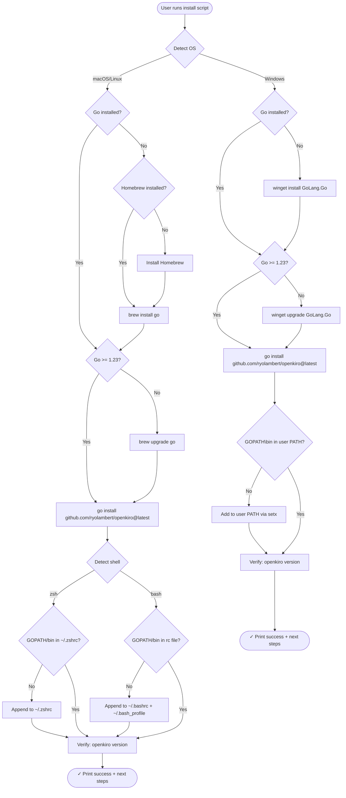
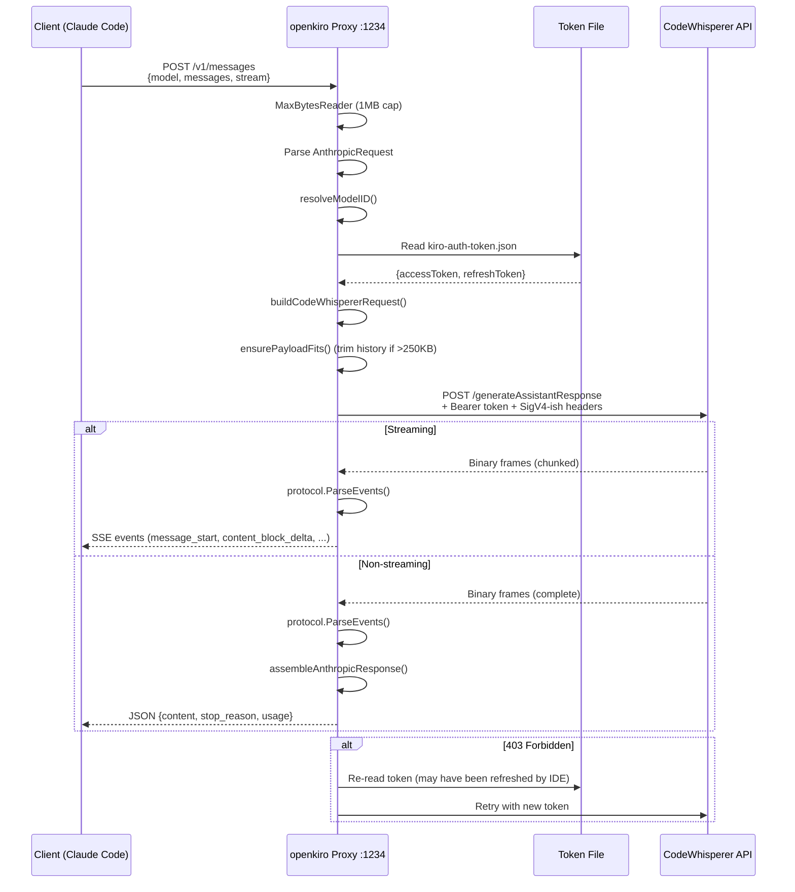
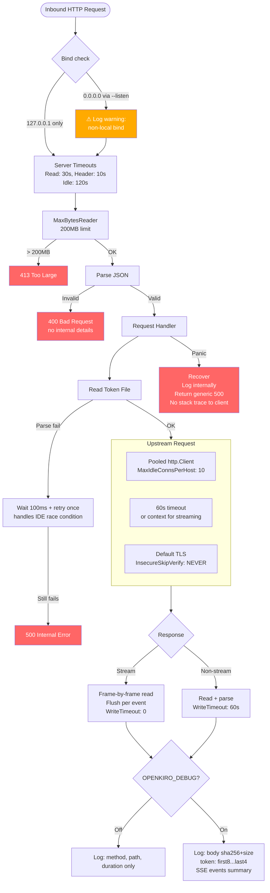
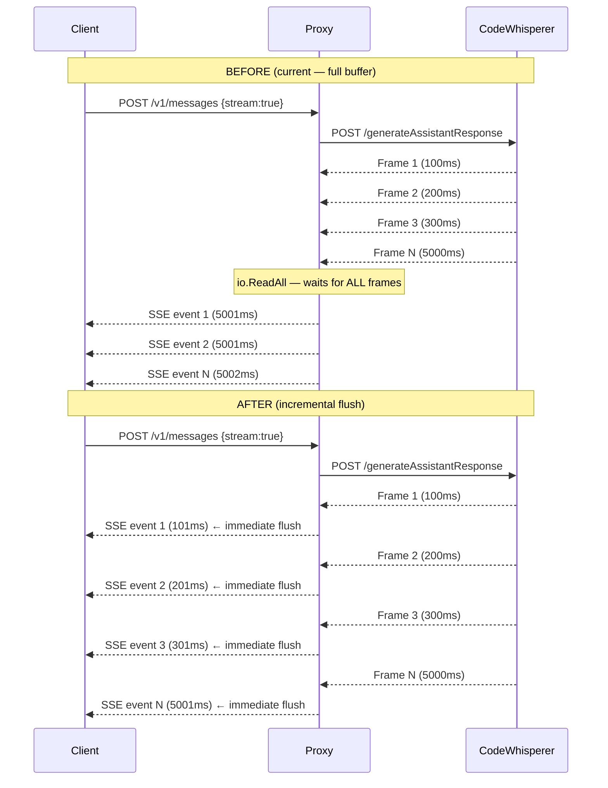
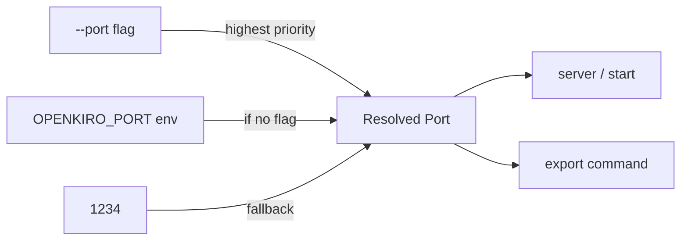

# Architecture Diagrams

## 1. Component Architecture

```mermaid
graph TB
    subgraph Client["Client Layer"]
        CC[Claude Code]
        OC[OpenClaw]
        CURL[curl / HTTP client]
    end

    subgraph OpenKiro["openkiro binary"]
        CLI[CLI Router<br/>server | start | stop | status<br/>read | refresh | export | claude]

        subgraph Server["HTTP Proxy Server :1234"]
            MW[Log Middleware]
            BL[Body Limiter<br/>MaxBytesReader 200MB]
            MSG[POST /v1/messages]
            MOD[GET /v1/models<br/>sorted deterministic]
            HP[GET /health]
        end

        subgraph Security["Security Layer"]
            BIND[Bind Guard<br/>127.0.0.1 default<br/>--listen for override]
            TIMEOUT[Timeout Config<br/>Read: 30s | Write: 60s/0<br/>Idle: 120s | Header: 10s]
            REDACT[Log Redactor<br/>tokens: first8...last4<br/>bodies: sha256 summary only]
            PANIC[Panic Handler<br/>generic 500, no stack]
        end

        TM[Token Manager<br/>read from ~/.aws/sso/cache/<br/>retry on parse failure]
        TR[Request Translator<br/>Anthropic → CodeWhisperer]

        subgraph Streaming["Streaming Engine"]
            RP[Response Parser<br/>protocol/sse_parser.go]
            INCR[Incremental Reader<br/>frame-by-frame, no buffering]
            FLUSH[http.Flusher<br/>per-event flush to client]
        end

        subgraph Transport["Upstream Transport"]
            POOL[Connection Pool<br/>single http.Client<br/>MaxIdleConnsPerHost: 10]
            CTIMEOUT[Client Timeout<br/>60s non-stream, ctx for stream]
        end

        subgraph Service["service/ package"]
            DM[Daemon Manager<br/>start/stop/status/PID]
            LD[launchd.go<br/>macOS plist gen]
            WS[windows.go<br/>Windows Service via x/sys]
        end

        subgraph Config["Configuration"]
            PORT[Port Resolution<br/>--port > OPENKIRO_PORT > 1234]
            LOG[Log Router<br/>foreground→stderr<br/>background→file]
            DBG[Debug Gate<br/>OPENKIRO_DEBUG<br/>zero alloc when off]
        end
    end

    subgraph Upstream["AWS Backend"]
        CW[CodeWhisperer API<br/>us-east-1]
    end

    subgraph FS["Filesystem"]
        TOKEN[~/.aws/sso/cache/<br/>kiro-auth-token.json]
        KIRODB[Kiro CLI SQLite DB<br/>pure-Go driver, no shell-out]
        LOGS[Platform Log Dir<br/>~/Library/Logs/openkiro/<br/>%LOCALAPPDATA%\openkiro\logs\]
        PID[PID File]
        PLIST[~/Library/LaunchAgents/<br/>com.openkiro.proxy.plist]
    end

    CC & OC & CURL -->|HTTP| BIND
    BIND --> BL --> MSG & MOD & HP
    MSG --> TM
    MSG --> TR
    TR -->|via pool| POOL --> CW
    CW -->|binary frames| INCR
    INCR --> RP --> FLUSH --> MSG
    TM --> TOKEN
    CLI -->|refresh| KIRODB
    CLI -->|start/stop| DM
    DM -->|macOS| LD
    DM -->|Windows| WS
    LD --> PLIST
    DM --> PID
    LOG --> LOGS
```

## 2. Install Flow



## 3. Daemon Lifecycle

```mermaid
statediagram-v2
    [*] --> Idle

    Idle --> Starting: openkiro start [--port N]
    Starting --> CheckPID: Read PID file
    CheckPID --> AlreadyRunning: PID exists + process alive
    CheckPID --> GenerateConfig: No PID / stale PID

    AlreadyRunning --> Idle: Print error + exit 1

    GenerateConfig --> LaunchdLoad: macOS
    GenerateConfig --> ServiceInstall: Windows

    LaunchdLoad --> WritePlist: Generate plist with port + log path
    WritePlist --> LaunchctlLoad: launchctl load plist
    LaunchctlLoad --> Running

    ServiceInstall --> RegisterService: sc.exe create / x/sys/windows/svc
    RegisterService --> StartService: sc.exe start / svc.Run
    StartService --> Running

    Running --> Stopping: openkiro stop
    Running --> Crashed: Unexpected exit
    Running --> Running: Serving requests on :1234

    Stopping --> LaunchctlUnload: macOS
    Stopping --> StopService: Windows

    LaunchctlUnload --> CleanPID: launchctl unload plist
    StopService --> CleanPID: Stop + delete service

    CleanPID --> Idle: Remove PID file

    Crashed --> Running: Auto-restart (KeepAlive / recovery)
    Crashed --> Idle: Max retries exceeded

    state Running {
        [*] --> Listening
        Listening --> HandleRequest: Incoming HTTP
        HandleRequest --> ReadToken: Get auth token
        ReadToken --> Translate: Anthropic → CW
        Translate --> Proxy: Send to AWS
        Proxy --> ParseResponse: Binary → SSE/JSON
        ParseResponse --> Respond: Send to client
        Respond --> Listening
    }
```

## 4. Request Flow (Detailed)



## 5. Security & Hardening Layers

> Maps to [security-performance-audit.md](security-performance-audit.md) findings



## 6. Streaming: Before vs After






## 7. Port Resolution


