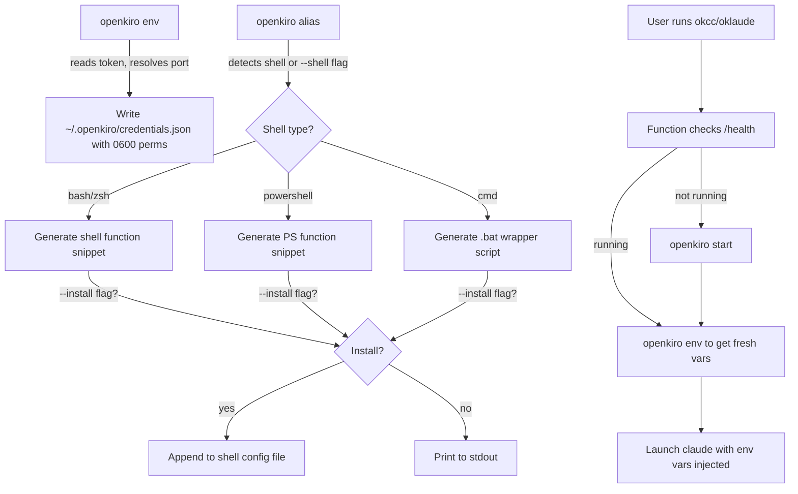

# Implementation Plan — Secure Env Var Storage, CLI Alias Generation, and README Update

## Problem Statement

openkiro currently prints env vars to stdout via `export` and requires users to manually `eval` them.
There's no persistent storage, no way to auto-inject them into a `claude` invocation, and no alias
generation for any shell. Users want a streamlined workflow: run one command, get a shell alias that
auto-starts the proxy and launches Claude Code with fresh credentials.

## Requirements

1. Store extracted env vars (`ANTHROPIC_BASE_URL`, `ANTHROPIC_API_KEY`) in a permissions-restricted (`0600`) file at `~/.openkiro/credentials.json`
2. New `openkiro alias` command that generates shell functions for bash/zsh, PowerShell, and CMD (`.bat` wrapper)
3. Default alias names: `okcc` and `oklaude` (customizable via `--name`)
4. `--install` flag to write directly to shell config files (`~/.bashrc`, `~/.zshrc`, PowerShell `$PROFILE`); without it, just print the snippet
5. Generated alias/function auto-checks server health and runs `openkiro start` if needed, then injects fresh env vars and launches `claude`
6. Update README with new commands/workflow and replace the ASCII art header with an "openkiro" logo

## Background

- The codebase follows standard Go project layout: `cmd/openkiro/` (thin entry point), `internal/` (private packages), zero external dependencies — we keep it that way
- `os.UserHomeDir()` works cross-platform; `~/.openkiro/` is a valid path on macOS, Linux, and Windows
- Existing `token.ExportEnvVars()` in `internal/token/token.go` already reads the token and formats env vars per OS — we can reuse that logic
- `internal/daemon/daemon.go` has `CleanStalePID()`/`ResolvePort()`/`WritePID()` etc. for background proxy management on macOS (launchd) and Linux (PID file)
- `cmd/openkiro/main.go` has `cmdStart()`/`cmdStop()`/`cmdStatus()` that orchestrate daemon lifecycle
- CMD doskey macros don't support chaining commands reliably — a `.bat` wrapper script is the correct Windows CMD approach
- PowerShell functions in `$PROFILE` are the standard Windows alias pattern

## Project Layout Reference

```
cmd/openkiro/main.go           ← CLI entry point, command routing
internal/
  proxy/                       ← HTTP server, request/response translation, types
    types.go                   ← shared types, constants, model map
    request.go                 ← request building, payload trimming
    response.go                ← response assembly, stream events
    server.go                  ← HTTP handlers, middleware
  daemon/                      ← background process lifecycle
    daemon.go                  ← start/stop helpers, PID, launchd, claude config
  token/                       ← auth token management
    token.go                   ← token read/refresh/export, debug logging, HTTP client
  protocol/                    ← CodeWhisperer binary frame → SSE event parser
    sse_parser.go
```

## Proposed Solution



## Task Breakdown

### Task 1: Implement `openkiro env` command — secure credential storage

**Objective:** Add a new `env` command that reads the current token, resolves the port, and writes `ANTHROPIC_BASE_URL` and `ANTHROPIC_API_KEY` to `~/.openkiro/credentials.json` with `0600` permissions. Also prints the values to stdout (reusing existing `token.ExportEnvVars` format) so it still works with `eval`.

**Implementation guidance:**

- Add credential storage functions in `internal/token/credentials.go`:
  - `CredentialsDir() (string, error)` — returns `~/.openkiro/` using `os.UserHomeDir()`
  - `CredentialsFilePath() (string, error)` — returns `~/.openkiro/credentials.json`
  - `WriteCredentials(baseURL, apiKey string) error` — creates the dir (`0700`) and writes the JSON file (`0600`)
  - `ReadCredentials() (baseURL, apiKey string, err error)`
- Add `cmdEnv()` in `cmd/openkiro/main.go` that calls `token.GetToken()`, `daemon.ResolvePort()`, writes credentials via `token.WriteCredentials()`, and prints the export lines (delegate to existing `token.ExportEnvVars` logic)
- Wire up `"env"` case in `main()` switch

**Test requirements:** Test `WriteCredentials`/`ReadCredentials` round-trip in `internal/token/credentials_test.go` using a temp dir. Test file permissions are `0600`.

**Demo:** Run `openkiro env`, see credentials written to `~/.openkiro/credentials.json`, verify file permissions, and confirm stdout still shows export-ready lines.

---

### Task 2: Implement shell alias generation (bash/zsh)

**Objective:** Add `openkiro alias` command that generates bash/zsh function snippets for `okcc` and `oklaude` (or custom `--name`). The function checks proxy health, auto-starts if needed, fetches fresh env vars via `openkiro env`, and launches `claude` with them.

**Implementation guidance:**

- Create `internal/daemon/alias.go` with the alias generation logic
- Add `GenerateBashAlias(aliasName, openkiroPath string) string` that returns a shell function like:
  ```bash
  okcc() {
    if ! curl -sf http://localhost:${OPENKIRO_PORT:-1234}/health >/dev/null 2>&1; then
      openkiro start
      sleep 1
    fi
    eval "$(openkiro env)"
    claude "$@"
  }
  ```
- Add `cmdAlias()` in `cmd/openkiro/main.go` that parses flags: `--name` (repeatable or comma-separated, defaults to `okcc,oklaude`), `--shell` (auto-detect or explicit: `bash`, `zsh`, `powershell`, `cmd`), `--port`
- Without `--install`, print the snippet to stdout
- Detect the current shell from `$SHELL` env var on Unix, default to PowerShell on Windows
- Wire up `"alias"` case in `main()` switch

**Test requirements:** Test that `GenerateBashAlias` produces valid output containing the alias name and expected commands in `internal/daemon/alias_test.go`. Test default alias names are both generated.

**Demo:** Run `openkiro alias` and see bash/zsh function snippets printed for both `okcc` and `oklaude`. Run `openkiro alias --name myclaud` for a custom name.

---

### Task 3: Implement PowerShell and CMD alias generation

**Objective:** Extend `openkiro alias` to support PowerShell function generation and CMD `.bat` wrapper script generation.

**Implementation guidance:**

- Add to `internal/daemon/alias.go`:
  - `GeneratePowerShellAlias(aliasName, openkiroPath string) string` that returns:
    ```powershell
    function okcc {
      try { Invoke-RestMethod -Uri "http://localhost:$($env:OPENKIRO_PORT ?? '1234')/health" -ErrorAction Stop | Out-Null } catch { & openkiro start; Start-Sleep 1 }
      & openkiro env | ForEach-Object { if ($_ -match '^(\w+)=(.*)$') { [Environment]::SetEnvironmentVariable($Matches[1], $Matches[2], 'Process') } }
      & claude @args
    }
    ```
  - `GenerateCmdBat(aliasName, openkiroPath string) string` that returns a `.bat` script content. For CMD, the `--install` flag writes the `.bat` file to `~/.openkiro/okcc.bat` (and tells the user to add that dir to PATH).
- Update `cmdAlias()` in `cmd/openkiro/main.go` to dispatch to the correct generator based on detected/specified shell
- For PowerShell `env` output, add a mode in `token.ExportEnvVars` (or `cmdEnv`) that outputs `KEY=VALUE` pairs (no `export` prefix) so PowerShell can parse them generically

**Test requirements:** Test PowerShell and CMD generators produce expected output in `internal/daemon/alias_test.go`. Test shell auto-detection logic.

**Demo:** Run `openkiro alias --shell powershell` and see PowerShell function. Run `openkiro alias --shell cmd` and see `.bat` content.

---

### Task 4: Implement `--install` flag for writing to shell config files

**Objective:** When `--install` is passed, append the generated alias to the appropriate shell config file. Detect and avoid duplicate installations.

**Implementation guidance:**

- Add `InstallAlias(shellType, snippet, configPath string) error` in `internal/daemon/alias.go`
- For bash: append to `~/.bashrc` (check if `~/.bash_profile` sources it; if not, also offer `~/.bash_profile`)
- For zsh: append to `~/.zshrc`
- For PowerShell: append to `$PROFILE` path (get via `powershell -Command "echo $PROFILE"` or use known default paths)
- For CMD: write `.bat` files to `~/.openkiro/` and print instructions to add to PATH
- Before appending, check if the file already contains `# openkiro-alias` marker comment to avoid duplicates
- Wrap the generated block with `# openkiro-alias-begin` / `# openkiro-alias-end` markers
- Print confirmation message with the file modified and instructions to reload (`source ~/.zshrc`, etc.)

**Test requirements:** Test duplicate detection logic (marker-based) in `internal/daemon/alias_test.go`. Test that install targets the correct file per shell.

**Demo:** Run `openkiro alias --install`, verify the alias is appended to the correct shell config file with markers. Run again, verify it doesn't duplicate. Open a new terminal and run `okcc` to see it work end-to-end.

---

### Task 5: Update README with new features and openkiro ASCII art

**Objective:** Replace the existing ASCII art with an "openkiro" ASCII art logo. Document the new `env` and `alias` commands. Update the commands table and quick start guide.

**Implementation guidance:**

- Generate a new ASCII art logo for "openkiro" (using a block/banner style consistent with the existing aesthetic)
- Replace the `<pre>` block in README.md with the new art
- Add `openkiro env` and `openkiro alias` to the Commands table
- Add a new section "Shell Aliases" after "Quick start" explaining the alias workflow:
  - Print-only usage: `openkiro alias`
  - Install usage: `openkiro alias --install`
  - Custom name: `openkiro alias --name myclaud`
  - Shell override: `openkiro alias --shell powershell`
- Update the quick start section to mention `openkiro alias --install` as the recommended setup after building
- Update the usage help text in `cmd/openkiro/main.go` `main()` to include the new commands

**Test requirements:** None (documentation only).

**Demo:** View the updated README on GitHub, see the new ASCII art and complete documentation for the alias workflow.

---

### Task 6: Wire everything together and update CLI help

**Objective:** Ensure all new commands are integrated into `cmd/openkiro/main.go`, help text is updated, and the full end-to-end flow works.

**Implementation guidance:**

- Update the usage block in `cmd/openkiro/main.go` `main()` to include `env` and `alias` commands with descriptions
- Ensure `openkiro env --port 9000` works (port flag support via `daemon.ResolvePort()`)
- Ensure `openkiro alias --port 9000` generates aliases that use the custom port
- Verify the full flow: `openkiro alias --install` → open new shell → `okcc` → proxy auto-starts → claude launches with correct env vars
- Verify Windows flow: `openkiro alias --shell powershell --install` works

**Test requirements:** Integration-style test that verifies `cmdEnv` writes credentials and `cmdAlias` generates valid output referencing those credentials.

**Demo:** Full end-to-end demo: fresh terminal, run `okcc`, proxy starts automatically, Claude Code launches with openkiro credentials injected.
